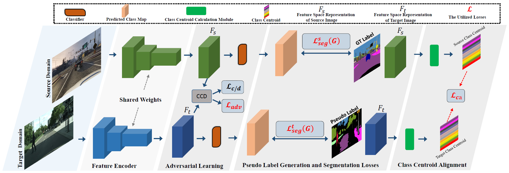

# Enhanced Feature Alignment for Unsupervised Domain Adaptation of Semantic Segmentation


Pytorch implementation of our method for adapting semantic segmentation from the synthetic dataset to the real dataset. 

Network Architecture
--------------------
The architecture of our proposed model is as follows


## Installation
* Install PyTorch 1.3 with Python 3 and CUDA 10.0 

* Clone this repo
```
git clone https://github.com/chentao2016/EFA.git

```
## Dataset
* Download the CycleGAN transferred [GTA5 Dataset](https://drive.google.com/open?id=1OBvYVz2ND4ipdfnkhSaseT8yu2ru5n5l) as the source domain

* Download the [Cityscapes Dataset](https://www.cityscapes-dataset.com/) as the target domain


## Testing

```
cd EFA

```

* Download the trained VGG model [GTA5-to-Cityscapes VGG model](https://efsal.oss-cn-shanghai.aliyuncs.com/GTA5_vgg_42.9.pth) and put it in the `model` folder

```
python evaluate_cityscapes.py --model VGG --save ./result/cityscapes --restore-from ./model/GTA5_vgg_42.9.pth
python compute_iou.py /data1/CityScapes/gtFine/val result/cityscapes
```
* Or,download the trained ResNet model [GTA5-to-Cityscapes ResNet model](https://efsal.oss-cn-shanghai.aliyuncs.com/GTA5_resnet_48.8.pth) and put it in the `model` folder

```
python evaluate_cityscapes.py --model ResNet --save ./result/cityscapes --restore-from ./model/GTA5_resnet_48.8.pth
python compute_iou.py /data1/CityScapes/gtFine/val result/cityscapes
```
## Training
* Download the initial pre-trained VGG model [Initial VGG model](https://efsal.oss-cn-shanghai.aliyuncs.com/vgg16_init.pth) and put it in the `model` folder. Training example (without pseudo labels):
```
python train.py --model VGG --snapshot-dir ./snapshots/
```
Prepare the pseudo labels and the global feature centroid
```
python SSL.py --model VGG 
python center_source_cal.py --model VGG 
python center_target_cal.py --model VGG 
```
Training example (with pseudo labels):
```
python train_with_pseudo_label.py  --model VGG  --snapshot-dir ./snapshots/tain_with_pseudo_label 
```
* Or,download the initial pre-trained ResNet model [Initial ResNet model](https://efsal.oss-cn-shanghai.aliyuncs.com/resnet_init.pth) and put it in the `model` folder. Training example (without pseudo labels):

```
python train.py --model ResNet --snapshot-dir ./snapshots/
```
Prepare the pseudo labels and the global feature centroid
```
python SSL.py --model ResNet 
python center_source_cal.py --model ResNet 
python center_target_cal.py --model ResNet 
```
Training example (with pseudo labels):
```
python train_with_pseudo_label.py  --model ResNet  --snapshot-dir ./snapshots/tain_with_pseudo_label 
```